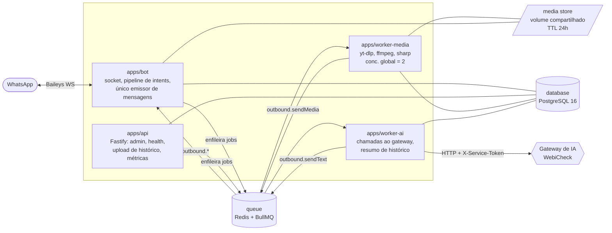

# 1. Arquitetura

## 1.1 Estilo escolhido

**Hexagonal (ports & adapters) sobre um monorepo pnpm, com processos separados
comunicando por filas BullMQ.**

Justificativa direta dos requisitos:

| Requisito | Consequência arquitetural |
|---|---|
| "Não criar um arquivo monolítico com milhares de linhas" | Domínio em `packages/core`, cada capacidade em um módulo próprio registrado por um registry |
| "Baileys em versão estável e fixada" (mas 7.x ainda é RC — ver §6) | Baileys fica atrás da porta `WhatsAppGateway`; trocar 6.7.24 → 7.x mexe em **um** adaptador |
| Gateway de IA próprio, servindo mais de uma aplicação | Serviço `apps/gateway` com banco próprio; o core do bot só conhece a porta `AiGateway` |
| "Memória não pode ficar presa ao provedor" | Memória é tabela no Postgres e é montada em prompt pelo `ContextBuilder`, não pelo histórico de conversa da OpenAI/Groq |
| "Separar serviços: bot, api, worker-media, worker-ai" | Quatro aplicações, um único banco, uma única fila |
| "Limitar downloads simultâneos", "um trabalho ativo por usuário" | Concorrência é propriedade do worker + BullMQ, não do processo do WhatsApp |

### Regra de ouro: um único dono do socket

**Somente `apps/bot` abre o socket Baileys.** Nenhum worker envia mensagem
diretamente. Workers publicam na fila `outbound`, e o `bot` é o único consumidor.

Motivos: a sessão do WhatsApp é um recurso único e stateful (duas conexões com as
mesmas credenciais causam desconexão em loop e risco de banimento); centralizar a
saída dá um ponto único para rate limit, para registrar toda mensagem enviada em
`bot_messages` (indispensável para detectar "resposta ao bot") e para apagar o
arquivo temporário logo após o upload.

## 1.2 Serviços



| Serviço | Responsabilidade | Não faz |
|---|---|---|
| `bot` | Conectar, autenticar por QR, normalizar eventos, rodar o pipeline de intents, despachar comandos síncronos baratos, enfileirar os caros, consumir `outbound` | Nunca chama IA. Nunca roda `yt-dlp`/`ffmpeg` |
| `api` | Painel/admin HTTP, healthchecks, upload de `.txt`/`.zip` de histórico, ajuste de limites, exportar auditoria | Nunca toca no socket |
| `worker-media` | Download (`yt-dlp`), conversão (`ffmpeg`), figurinhas (`sharp`/`webpmux`), transcodificação, cache 24h, limpeza de temporários | Nunca chama IA |
| `worker-ai` | Montar contexto, chamar `AiGateway`, aplicar circuit breaker e failover, processar blocos de histórico, gerar perfil de estilo | Nunca baixa mídia |

`database` e `queue` são serviços de infraestrutura do Compose (PostgreSQL 16 e
Redis 7), sem código próprio.

## 1.3 Camadas dentro do código

```
adapters (I/O)          baileys · postgres · redis/bullmq · http(gateway IA) · yt-dlp · ffmpeg · lrclib
        ▲ implementam
      ports (interfaces)  WhatsAppGateway · AiGateway · MemoryRepository · MediaDownloader ·
        ▲ dependem de     StickerFactory · LyricsProvider · Clock · Rng · ObjectStore
    application (casos de uso)  ExecuteCommand · HandleMention · HandleReplyToBot ·
        ▲                       ResolveDownloadOptions · ImportHistory · BuildPersona
      domain (puro)       Intent · GroupSettings · MemoryFact · Persona · Consent · Quota · Limits
```

`packages/core` (domain + application) **não importa** Baileys, `pg`, `axios` nem
SDK de IA. Isso é o que torna a suíte de testes de aceite executável sem WhatsApp,
sem Postgres e sem rede — os 20 critérios de aceite viram testes de unidade sobre
o core com adaptadores falsos, e só um subconjunto precisa de integração.

## 1.4 Decisões registradas (ADR resumido)

**ADR-01 — Baileys atrás de porta, versão fixada exata. `6.7.24`. (Decidido.)**
Não existe hoje release estável da linha 7.x (`latest` = `7.0.0-rc14`); o último
estável é `6.7.24`, publicado em 2026-07-29 sob a dist-tag `legacy`. Fixamos
`baileys` em **`6.7.24` exato** (sem `^`, sem `~`) e isolamos tudo atrás de
`WhatsAppGateway`. Escolha feita sobre a alternativa `7.0.0-rc14` porque o
briefing pede versão estável, e porque o custo de migrar depois é baixo justamente
por causa da porta. Detalhes e plano de migração em §6.1.1.

**ADR-02 — Fila para tudo que é lento, resposta imediata para tudo que é barato.**
Comandos como `!ping`, `!menu`, `!status`, administração e AFK respondem no
processo `bot`. Download, conversão, transcrição, importação e IA vão para fila.
Assim, um `yt-dlp` travado nunca segura o event loop do socket.

**ADR-03 — A IA é uma capacidade, nunca um observador.**
Não existe hook "toda mensagem passa pela IA". O único caminho até `worker-ai` é
um `AiIntent`, e apenas dois resolvers do pipeline conseguem emitir um. Isso é
verificado por teste: um teste garante que o conjunto de emissores de `AiIntent`
é exatamente `{MentionResolver, ReplyToBotResolver}`.

**ADR-07 — Gateway de IA próprio, como serviço separado. (Decidido.)**
Em vez de consumir o gateway do WebiCheck, construímos `apps/gateway`: processo e
banco próprios, credenciais próprias, multi-aplicação. Motivos e desenho em §5.
Consequência para o cronograma: a Etapa 2 deixa de depender de terceiro e passa a
incluir a construção do gateway.

**ADR-04 — Memória própria, não thread do provedor.**
Nada de `conversation_id` de fornecedor. Todo contexto é remontado a cada chamada
a partir do Postgres pelo `ContextBuilder`. Trocar de provedor no meio de uma
conversa não muda personalidade nem contexto (critério de aceite 12).

**ADR-05 — Seleção numérica é o caminho principal, botão é enfeite.**
O `PendingChoice` (escolha pendente por usuário+chat, com TTL) é a fonte da
verdade. Botões interativos, quando disponíveis, apenas escrevem a mesma escolha.

**ADR-06 — Postgres com Kysely + migrations SQL versionadas.**
Kysely dá tipagem estrita sobre SQL real, sem esconder o schema atrás de um ORM.
Migrations são arquivos `.sql` numerados, aplicados por um runner próprio, com
`up` obrigatório e `down` quando reversível.
