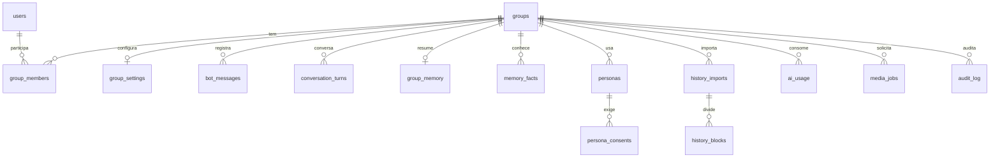

# 3. Modelo do banco (PostgreSQL 16)

> **Validado:** todo o DDL desta página foi extraído e executado contra um
> PostgreSQL 16.13 real (18 tabelas criadas, sem erro), e os comportamentos
> críticos foram testados: segundo consentimento ativo para a mesma persona é
> rejeitado pelo índice parcial; `DELETE` de usuário limpa seus `memory_facts` e
> desvincula a persona; `DELETE` de grupo apaga memória, fatos, personas,
> consentimentos e configurações em cascata; e `INSERT` de um fato com categoria
> sensível (`kind = 'health'`) é recusado pelo `CHECK`.

Convenções: `id` é `uuid` gerado pela aplicação (v7, ordenável por tempo);
timestamps em `timestamptz`; JIDs guardados como texto normalizado; toda tabela
com dado de pessoa tem caminho de exclusão (§3.6).

## 3.1 Visão geral



## 3.2 Identidade e configuração

```sql
CREATE TABLE groups (
  id             uuid PRIMARY KEY,
  jid            text NOT NULL UNIQUE,          -- 1203...@g.us
  subject        text,
  is_active      boolean NOT NULL DEFAULT true,
  joined_at      timestamptz NOT NULL DEFAULT now(),
  updated_at     timestamptz NOT NULL DEFAULT now()
);

CREATE TABLE users (
  id             uuid PRIMARY KEY,
  jid            text NOT NULL UNIQUE,          -- @s.whatsapp.net
  lid            text UNIQUE,                   -- @lid (identidade nova do WhatsApp)
  push_name      text,
  first_seen_at  timestamptz NOT NULL DEFAULT now(),
  last_seen_at   timestamptz NOT NULL DEFAULT now()
);
CREATE INDEX users_lid_idx ON users (lid) WHERE lid IS NOT NULL;

CREATE TABLE group_members (
  group_id       uuid NOT NULL REFERENCES groups(id) ON DELETE CASCADE,
  user_id        uuid NOT NULL REFERENCES users(id) ON DELETE CASCADE,
  role           text NOT NULL DEFAULT 'member'
    CHECK (role IN ('member','admin','superadmin')),
  joined_at      timestamptz NOT NULL DEFAULT now(),
  left_at        timestamptz,
  PRIMARY KEY (group_id, user_id)
);

-- Todos os limites do §13 do briefing vivem aqui, com fallback para o ambiente.
CREATE TABLE group_settings (
  group_id            uuid PRIMARY KEY REFERENCES groups(id) ON DELETE CASCADE,
  prefix              text    NOT NULL DEFAULT '!',
  ai_enabled          boolean NOT NULL DEFAULT true,
  memory_enabled      boolean NOT NULL DEFAULT true,
  learning_enabled    boolean NOT NULL DEFAULT true,   -- aprendizado contínuo (§7)
  persona_id          uuid,                            -- FK adiada (ver 3.4)
  ai_daily_limit      integer NOT NULL DEFAULT 200,
  ai_user_daily_limit integer NOT NULL DEFAULT 30,
  media_daily_limit   integer NOT NULL DEFAULT 100,
  max_video_seconds   integer NOT NULL DEFAULT 1200,   -- 20 min
  max_file_bytes      bigint  NOT NULL DEFAULT 47185920, -- ~45 MB
  features            jsonb   NOT NULL DEFAULT '{}',   -- antilink, antispam, welcome...
  updated_at          timestamptz NOT NULL DEFAULT now()
);
```

## 3.3 Núcleo do gate da IA

`bot_messages` é a tabela que torna o critério de aceite 3 verificável: só é
"resposta ao bot" o que cita um `stanza_id` que **nós** registramos ao enviar.
Confiar no `contextInfo.participant` da mensagem recebida seria confiar em campo
controlado pelo remetente.

```sql
CREATE TABLE bot_messages (
  id             uuid PRIMARY KEY,
  group_id       uuid REFERENCES groups(id) ON DELETE CASCADE,
  chat_jid       text NOT NULL,
  stanza_id      text NOT NULL,                 -- key.id da mensagem que ENVIAMOS
  kind           text NOT NULL,                 -- ai_reply | command_reply | media | system
  reply_to_user  text,                          -- a quem respondíamos
  preview        text,                          -- primeiros 500 chars, para contexto
  sent_at        timestamptz NOT NULL DEFAULT now(),
  UNIQUE (chat_jid, stanza_id)
);
CREATE INDEX bot_messages_lookup_idx ON bot_messages (chat_jid, stanza_id);
-- Retenção: purgado após BOT_MESSAGES_RETENTION_DAYS (padrão 30).

-- Histórico curto por thread (grupo + usuário) usado para continuar a conversa.
CREATE TABLE conversation_turns (
  id             uuid PRIMARY KEY,
  group_id       uuid NOT NULL REFERENCES groups(id) ON DELETE CASCADE,
  user_id        uuid REFERENCES users(id) ON DELETE CASCADE,
  role           text NOT NULL CHECK (role IN ('user','assistant')),
  content        text NOT NULL,                 -- cifrado em repouso (§3.5)
  provider       text,                          -- provedor que gerou (role=assistant)
  model          text,
  created_at     timestamptz NOT NULL DEFAULT now()
);
CREATE INDEX conversation_turns_thread_idx
  ON conversation_turns (group_id, user_id, created_at DESC);
```

## 3.4 Memória e personalidade

```sql
-- Um resumo consolidado por grupo, versionado.
CREATE TABLE group_memory (
  group_id       uuid PRIMARY KEY REFERENCES groups(id) ON DELETE CASCADE,
  summary        text NOT NULL,                 -- cifrado
  version        integer NOT NULL DEFAULT 1,
  source         text NOT NULL DEFAULT 'live',  -- live | import | merged
  provider       text,                          -- quem gerou o resumo vigente
  updated_at     timestamptz NOT NULL DEFAULT now()
);

-- Fatos granulares, para permitir "!esquecer @fulano" sem apagar o grupo todo.
CREATE TABLE memory_facts (
  id             uuid PRIMARY KEY,
  group_id       uuid NOT NULL REFERENCES groups(id) ON DELETE CASCADE,
  subject_user_id uuid REFERENCES users(id) ON DELETE CASCADE,  -- NULL = fato do grupo
  kind           text NOT NULL
    CHECK (kind IN ('topic','inside_joke','vocabulary','role','event','preference')),
  content        text NOT NULL,   -- cifrado
  confidence     real NOT NULL DEFAULT 0.5,
  source         text NOT NULL,   -- import:<uuid> | live | manual
  created_at     timestamptz NOT NULL DEFAULT now(),
  expires_at     timestamptz
);
CREATE INDEX memory_facts_group_idx   ON memory_facts (group_id, kind);
CREATE INDEX memory_facts_subject_idx ON memory_facts (subject_user_id);
-- O CHECK acima é a garantia estrutural do §12 do briefing: categorias sensíveis
-- (saúde, religião, orientação sexual, política, finanças, documentos, endereço)
-- não têm valor de 'kind' correspondente, então não existe onde gravá-las. Um bug
-- na camada de aplicação vira erro de constraint, não vazamento silencioso.

CREATE TABLE personas (
  id               uuid PRIMARY KEY,
  group_id         uuid NOT NULL REFERENCES groups(id) ON DELETE CASCADE,
  name             text NOT NULL,
  system_prompt    text NOT NULL,
  style_profile    jsonb NOT NULL DEFAULT '{}', -- métricas do §8, nunca frases literais
  based_on_user_id uuid REFERENCES users(id) ON DELETE SET NULL,
  is_active        boolean NOT NULL DEFAULT false,
  created_by       text NOT NULL,
  created_at       timestamptz NOT NULL DEFAULT now()
);

-- Critério de aceite 15: sem linha válida aqui, a persona não ativa.
CREATE TABLE persona_consents (
  id             uuid PRIMARY KEY,
  persona_id     uuid NOT NULL REFERENCES personas(id) ON DELETE CASCADE,
  subject_user_id uuid NOT NULL REFERENCES users(id) ON DELETE CASCADE,
  granted_by     text NOT NULL,        -- JID do admin que registrou
  granted_at     timestamptz NOT NULL DEFAULT now(),
  confirmed_at   timestamptz,          -- confirmação do próprio titular
  revoked_at     timestamptz,
  evidence       jsonb NOT NULL        -- stanza_id da confirmação, texto, timestamp
);
CREATE UNIQUE INDEX persona_consents_active_idx
  ON persona_consents (persona_id, subject_user_id) WHERE revoked_at IS NULL;

ALTER TABLE group_settings
  ADD CONSTRAINT group_settings_persona_fk
  FOREIGN KEY (persona_id) REFERENCES personas(id) ON DELETE SET NULL;
```

A regra "persona baseada em colega só ativa com consentimento" é aplicada em três
camadas: constraint (índice único de consentimento vivo), caso de uso
(`ActivatePersona` recusa sem `confirmed_at IS NOT NULL AND revoked_at IS NULL`) e
teste de aceite. `style_profile` guarda **métricas** (comprimento médio, taxa de
emoji, formalidade, frequência de pergunta), nunca transcrições — evita que o
perfil vire um arquivo de citações da pessoa.

## 3.5 Importação de histórico

```sql
CREATE TABLE history_imports (
  id             uuid PRIMARY KEY,
  group_id       uuid NOT NULL REFERENCES groups(id) ON DELETE CASCADE,
  requested_by   text NOT NULL,
  filename       text NOT NULL,
  sha256         text NOT NULL,
  size_bytes     bigint NOT NULL,
  status         text NOT NULL DEFAULT 'pending'
    CHECK (status IN ('pending','parsing','summarizing','done','failed','cancelled')),
  messages_total integer,
  blocks_total   integer,
  blocks_done    integer NOT NULL DEFAULT 0,
  error          text,
  raw_deleted_at timestamptz,        -- §7: apagar o arquivo bruto após resumir
  created_at     timestamptz NOT NULL DEFAULT now(),
  finished_at    timestamptz
);

CREATE TABLE history_blocks (
  id             uuid PRIMARY KEY,
  import_id      uuid NOT NULL REFERENCES history_imports(id) ON DELETE CASCADE,
  seq            integer NOT NULL,
  period_start   timestamptz,
  period_end     timestamptz,
  message_count  integer NOT NULL,
  summary        text,               -- cifrado
  provider       text,
  status         text NOT NULL DEFAULT 'pending',
  UNIQUE (import_id, seq)
);
```

## 3.6 Uso, saúde de provedor, mídia e auditoria

```sql
CREATE TABLE ai_usage (
  id                uuid PRIMARY KEY,
  group_id          uuid REFERENCES groups(id) ON DELETE SET NULL,
  user_id           uuid REFERENCES users(id) ON DELETE SET NULL,
  purpose           text NOT NULL,   -- chat | summary | transcript | persona
  provider          text NOT NULL,
  model             text,
  attempt           smallint NOT NULL DEFAULT 1,   -- 1..3 (máx. 3 provedores/solicitação)
  ok                boolean NOT NULL,
  error_code        text,
  latency_ms        integer NOT NULL,
  prompt_tokens     integer,
  completion_tokens integer,
  created_at        timestamptz NOT NULL DEFAULT now()
);
CREATE INDEX ai_usage_quota_idx ON ai_usage (group_id, created_at DESC);

CREATE TABLE ai_provider_health (
  provider             text PRIMARY KEY,
  state                text NOT NULL DEFAULT 'closed'
    CHECK (state IN ('closed','open','half_open')),
  consecutive_failures integer NOT NULL DEFAULT 0,
  opened_at            timestamptz,
  next_probe_at        timestamptz,
  updated_at           timestamptz NOT NULL DEFAULT now()
);

CREATE TABLE media_jobs (
  id             uuid PRIMARY KEY,
  group_id       uuid REFERENCES groups(id) ON DELETE SET NULL,
  user_id        uuid REFERENCES users(id) ON DELETE SET NULL,
  kind           text NOT NULL,     -- yt_mp3 | yt_mp4 | to_audio | sticker | togif | toimg | attp
  source_host    text,              -- domínio apenas; nunca a URL completa
  status         text NOT NULL DEFAULT 'queued',
  bytes          bigint,
  duration_s     integer,
  error_code     text,
  created_at     timestamptz NOT NULL DEFAULT now(),
  finished_at    timestamptz
);

CREATE TABLE media_cache (
  cache_key      text PRIMARY KEY,  -- sha256(kind + fonte canônica + parâmetros)
  file_path      text NOT NULL,
  mime           text NOT NULL,
  bytes          bigint NOT NULL,
  meta           jsonb NOT NULL DEFAULT '{}',
  created_at     timestamptz NOT NULL DEFAULT now(),
  expires_at     timestamptz NOT NULL    -- padrão: created_at + 24h
);
CREATE INDEX media_cache_expiry_idx ON media_cache (expires_at);

CREATE TABLE lyrics_cache (
  cache_key      text PRIMARY KEY,   -- normalizado: artista + título + duração
  provider       text NOT NULL,
  payload        jsonb NOT NULL,     -- título, artista, álbum, plain, synced
  created_at     timestamptz NOT NULL DEFAULT now(),
  expires_at     timestamptz NOT NULL
);

CREATE TABLE audit_log (
  id             uuid PRIMARY KEY,
  actor_jid      text NOT NULL,
  group_id       uuid REFERENCES groups(id) ON DELETE SET NULL,
  action         text NOT NULL,      -- memory.wipe | persona.activate | settings.update | user.ban
  target         text,
  payload        jsonb NOT NULL DEFAULT '{}',
  created_at     timestamptz NOT NULL DEFAULT now()
);
```

Tabelas da Etapa 4 (`afk`, `notes`, `economy_accounts`, `activity_ranking`,
`blocklist`, `giveaways`) entram em migrations próprias quando a etapa começar —
não são criadas antes de existir código que as use.

## 3.7 Criptografia, retenção e exclusão

- **Cifradas em repouso** (AES-256-GCM, chave em `ENCRYPTION_KEY`, envelope por
  linha com nonce próprio): `conversation_turns.content`, `group_memory.summary`,
  `memory_facts.content`, `history_blocks.summary`. Prefixo `v1:` no valor para
  permitir rotação de chave.
- **Retenção padrão:** `bot_messages` 30 dias · `conversation_turns` 30 dias ·
  `ai_usage` 90 dias · `media_cache` 24 h · `audit_log` 365 dias · arquivo bruto de
  importação apagado assim que o último bloco é resumido.
- **`!memoria apagar`** → `DELETE` em `group_memory`, `memory_facts`,
  `conversation_turns`, `history_imports` do grupo (cascata cobre os blocos).
- **`!esquecer @participante`** → remove `memory_facts` com aquele
  `subject_user_id`, remove os `conversation_turns` do usuário e agenda
  reprocessamento do resumo consolidado, para que o texto do resumo também deixe
  de citá-lo. Sem esse reprocessamento, o "esquecer" seria só aparente.
- Toda operação acima grava em `audit_log`.
