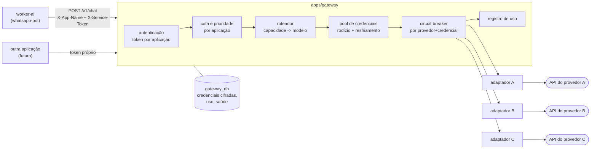

# 5. Gateway de IA próprio

> **Mudança de rumo (2026-08-22, decisão do responsável):** não vamos consumir o
> gateway do WebiCheck. Vamos **construir o nosso**, como serviço independente,
> com credenciais próprias obtidas em conta separada. Isso remove a dependência
> externa que bloqueava a Etapa 2 e nos dá controle sobre roteamento, failover e
> cota. O WebiCheck segue intocado e com a capacidade dele preservada — que era
> justamente a preocupação do briefing original.

## 5.1 Por que um serviço separado, e não uma biblioteca

O gateway é `apps/gateway`: processo próprio, porta própria, **banco próprio**.

A alternativa (um pacote importado pelo `worker-ai`) seria mais simples, mas
perderia as três propriedades que motivaram a decisão:

1. **Multi-aplicação.** O mesmo gateway atende `whatsapp-bot` hoje e qualquer
   outra aplicação sua depois, cada uma com token, cota e prioridade próprias.
   É o que impede o bot de comer a capacidade destinada a outra coisa.
2. **Segredo em um lugar só.** As chaves dos provedores existem apenas no
   processo do gateway. O bot nunca vê chave de IA — ele só tem um
   `X-Service-Token` que, se vazar, é revogado sem tocar nas chaves.
3. **Trocar provedor sem redeploy do bot.** Habilitar, desabilitar ou repriorizar
   provedor é linha em tabela, não build novo.

O bot continua falando com uma **porta** (`AiGateway`, §5.4) — se um dia o gateway
mudar, muda um adaptador.

## 5.2 Arquitetura



O banco do gateway é **separado** do banco do bot. Nenhuma tabela é compartilhada:
o bot não tem como ler credencial nem por acidente, nem por bug de query.

## 5.3 Rota

```http
POST /v1/chat
X-App-Name: whatsapp-bot
X-Service-Token: {token exclusivo da aplicação}
X-Request-Id: {uuid}            # correlação e idempotência
Content-Type: application/json

{
  "capability": "balanced",           # fast | balanced | deep
  "messages": [
    { "role": "system", "content": "..." },
    { "role": "user",   "content": "..." }
  ],
  "max_output_tokens": 800,
  "temperature": 0.8,
  "timeout_ms": 30000,
  "max_providers": 3,
  "provider_priority": ["a", "b", "c"]   # opcional; sobrepõe a prioridade da app
}
```

```json
{
  "text": "...",
  "provider": "b",
  "model": "...",
  "usage": { "prompt_tokens": 812, "completion_tokens": 96 },
  "latency_ms": 780,
  "attempts": [
    { "provider": "a", "ok": false, "http_status": 429, "latency_ms": 320 },
    { "provider": "b", "ok": true,  "latency_ms": 780 }
  ],
  "request_id": "..."
}
```

Erro (o gateway **normaliza** o erro de todo provedor para este formato):

```json
{ "error": { "code": "all_providers_failed", "message": "...",
             "attempts": [ ... ] }, "request_id": "..." }
```

Códigos: `unauthorized` · `app_quota_exceeded` · `all_providers_failed` ·
`circuit_open` · `timeout` · `invalid_request` · `payload_too_large`.

Rotas auxiliares: `GET /health` (liveness), `GET /v1/providers` (estado do
circuit breaker, sem segredo), `GET /v1/usage?app=&from=&to=` (agregado).

## 5.4 Porta interna do bot (inalterada)

Esta interface já estava definida e **não muda** com a troca de gateway — era
exatamente o objetivo de tê-la:

```ts
// packages/core/src/ports/ai-gateway.ts
export interface AiGateway {
  complete(req: AiRequest, opts: AiCallOptions): Promise<AiResult>;
}

export interface AiRequest {
  purpose: 'chat' | 'summary' | 'transcript' | 'persona';
  system: string;
  messages: AiMessage[];
  capability: 'fast' | 'balanced' | 'deep';
  maxOutputTokens: number;
  temperature?: number;
}

export interface AiMessage {
  role: 'user' | 'assistant';
  content: string;
  trusted: boolean;              // false para tudo que veio do grupo
}

export interface AiCallOptions {
  requestId: string;
  timeoutMs: number;
  maxProviders: 1 | 2 | 3;
  preferredProviders?: string[];
}

export type AiResult =
  | { ok: true;  text: string; provider: string; model: string;
      usage: { promptTokens?: number; completionTokens?: number };
      latencyMs: number; attempts: AiAttempt[] }
  | { ok: false; reason: AiFailure; attempts: AiAttempt[] };

export type AiFailure =
  | 'quota_exceeded' | 'all_providers_failed' | 'circuit_open'
  | 'timeout' | 'invalid_response' | 'refused';
```

`attempts[]` é o que torna o critério de aceite 11 observável de fora.

## 5.5 Adaptadores de provedor

Cada provedor é um arquivo implementando uma interface pequena:

```ts
// apps/gateway/src/providers/provider.ts
export interface ProviderAdapter {
  readonly name: string;
  complete(input: NormalizedRequest, cred: Credential, signal: AbortSignal)
    : Promise<NormalizedResponse>;
  classifyError(e: unknown): 'retryable' | 'fatal' | 'rate_limited';
}
```

Muitos provedores expõem uma API compatível com o formato
`/chat/completions`; para esses, um único adaptador genérico
(`openai-compatible.ts`) atende vários, mudando só `baseUrl` e nome do modelo —
tudo vindo do banco. Provedores com formato próprio ganham adaptador dedicado.

**Nenhum modelo, URL ou limite é escrito no código.** Tudo vive nas tabelas
`providers` e `models`, preenchidas na configuração a partir da documentação
vigente de cada provedor. Foi decisão consciente: limites de camada gratuita e
nomes de modelo mudam com frequência, e código com esses valores embutidos nasce
desatualizado.

`classifyError` é o que traduz o erro de cada provedor para a decisão de
failover — `rate_limited` e `retryable` vão para o próximo; `fatal` (payload
inválido, credencial errada) para a cadeia e alerta, porque tentar outro provedor
com o mesmo payload quebrado só desperdiça cota.

## 5.6 Pool de credenciais — várias contas por provedor

Você vai criar uma conta separada para as chaves do bot. O gateway suporta isso
de forma nativa: **N credenciais por provedor**, cada uma com rótulo, peso e
estado próprio.

Seleção, na ordem:

1. Descarta credencial desabilitada, com circuito aberto ou em resfriamento.
2. Entre as saudáveis, escolhe por **menor uso na janela atual** (round-robin
   ponderado por `weight`), o que espalha a carga em vez de queimar uma só.
3. Ao receber `429`/limite: marca aquela credencial em resfriamento até
   `Retry-After` (ou backoff padrão) e **tenta a próxima credencial do mesmo
   provedor antes de trocar de provedor** — trocar de provedor muda a qualidade
   da resposta, trocar de credencial não.
4. Esgotadas as credenciais do provedor, vai para o próximo provedor.

O teto de **3 provedores por solicitação** do briefing continua valendo; a
tentativa em outra credencial do mesmo provedor conta como o mesmo provedor.

> **Nota operacional:** manter contas separadas por aplicação é prática comum e
> legítima de isolamento. Vale só conferir, na hora de cadastrar, os termos de
> cada provedor sobre múltiplas contas — alguns permitem contas distintas por
> projeto mas proíbem várias contas com o único fim de somar cota gratuita. O
> gateway não depende disso: com uma credencial por provedor ele funciona igual,
> só com teto menor.

## 5.7 Failover e circuit breaker

| Condição | Ação |
|---|---|
| `429` / limite | próxima **credencial** do mesmo provedor; esgotadas, próximo provedor |
| `5xx`, timeout, conexão recusada, modelo fora do ar | próximo provedor |
| `4xx` que não seja 429 | **para**; erro `fatal`, sem gastar outro provedor |
| 3 provedores tentados | para; `all_providers_failed` |

**Circuit breaker por (provedor, credencial):** 5 falhas consecutivas abrem por
60 s → `half_open` libera 1 sondagem → sucesso fecha e zera; falha reabre com
backoff exponencial até 15 min. Circuito aberto é pulado sem gastar timeout.

**Sem resposta duplicada:** `X-Request-Id` é chave de idempotência. O gateway
guarda o resultado por 10 min; repetição do mesmo id devolve o resultado gravado
sem chamar provedor. Do lado do bot, a resposta enviada ao WhatsApp é registrada
com o mesmo id, então um retry do BullMQ não reenvia mensagem.

## 5.8 Banco do gateway (`gateway_db`)

> **Validado:** este DDL foi extraído e executado contra um PostgreSQL 16.13 real
> (8 tabelas, sem erro), em banco separado do banco do bot.

```sql
CREATE TABLE apps (
  id            uuid PRIMARY KEY,
  name          text NOT NULL UNIQUE,         -- 'whatsapp-bot'
  is_active     boolean NOT NULL DEFAULT true,
  daily_limit   integer,                      -- cota da aplicação (NULL = sem teto)
  priority      text[] NOT NULL DEFAULT '{}', -- ordem de provedores desta app
  created_at    timestamptz NOT NULL DEFAULT now()
);

CREATE TABLE app_tokens (
  id            uuid PRIMARY KEY,
  app_id        uuid NOT NULL REFERENCES apps(id) ON DELETE CASCADE,
  prefix        text NOT NULL,                -- 8 primeiros chars, para identificar em log
  token_hash    text NOT NULL,                -- argon2id do token; o valor cru nunca é gravado
  expires_at    timestamptz,
  revoked_at    timestamptz,
  last_used_at  timestamptz,
  created_at    timestamptz NOT NULL DEFAULT now()
);
CREATE UNIQUE INDEX app_tokens_prefix_idx ON app_tokens (prefix);

CREATE TABLE providers (
  name          text PRIMARY KEY,             -- rótulo interno
  adapter       text NOT NULL,                -- 'openai-compatible' | adaptador próprio
  base_url      text NOT NULL,
  is_enabled    boolean NOT NULL DEFAULT true,
  default_order integer NOT NULL DEFAULT 100,
  config        jsonb NOT NULL DEFAULT '{}'
);

CREATE TABLE models (
  id            uuid PRIMARY KEY,
  provider      text NOT NULL REFERENCES providers(name) ON DELETE CASCADE,
  model_id      text NOT NULL,                -- identificador exato do provedor
  capability    text NOT NULL CHECK (capability IN ('fast','balanced','deep')),
  max_output    integer NOT NULL DEFAULT 1024,
  is_enabled    boolean NOT NULL DEFAULT true,
  UNIQUE (provider, model_id)
);

CREATE TABLE provider_credentials (
  id            uuid PRIMARY KEY,
  provider      text NOT NULL REFERENCES providers(name) ON DELETE CASCADE,
  label         text NOT NULL,                -- 'conta-bot', 'conta-webicheck'
  secret_enc    bytea NOT NULL,               -- AES-256-GCM; chave em GATEWAY_KEK
  is_enabled    boolean NOT NULL DEFAULT true,
  weight        integer NOT NULL DEFAULT 1,
  cooldown_until timestamptz,
  created_at    timestamptz NOT NULL DEFAULT now(),
  UNIQUE (provider, label)
);

CREATE TABLE credential_health (
  credential_id uuid PRIMARY KEY REFERENCES provider_credentials(id) ON DELETE CASCADE,
  state         text NOT NULL DEFAULT 'closed'
    CHECK (state IN ('closed','open','half_open')),
  consecutive_failures integer NOT NULL DEFAULT 0,
  opened_at     timestamptz,
  next_probe_at timestamptz,
  updated_at    timestamptz NOT NULL DEFAULT now()
);

CREATE TABLE usage_log (
  id            uuid PRIMARY KEY,
  app_id        uuid REFERENCES apps(id) ON DELETE SET NULL,
  request_id    text NOT NULL,
  provider      text,
  credential_id uuid REFERENCES provider_credentials(id) ON DELETE SET NULL,
  model         text,
  attempt       smallint NOT NULL DEFAULT 1,
  ok            boolean NOT NULL,
  error_code    text,
  http_status   integer,
  latency_ms    integer NOT NULL,
  prompt_tokens integer,
  completion_tokens integer,
  created_at    timestamptz NOT NULL DEFAULT now()
);
CREATE INDEX usage_log_app_idx     ON usage_log (app_id, created_at DESC);
CREATE INDEX usage_log_request_idx ON usage_log (request_id);

-- Idempotência: resultado guardado por 10 min.
CREATE TABLE idempotency (
  request_id    text PRIMARY KEY,
  app_id        uuid NOT NULL REFERENCES apps(id) ON DELETE CASCADE,
  response      jsonb NOT NULL,
  created_at    timestamptz NOT NULL DEFAULT now(),
  expires_at    timestamptz NOT NULL
);
CREATE INDEX idempotency_expiry_idx ON idempotency (expires_at);
```

## 5.9 Segurança do gateway

- Chave de provedor **cifrada em repouso** (AES-256-GCM) com KEK em
  `GATEWAY_KEK`, que nunca vai ao banco. Descriptografada só em memória, no
  momento da chamada.
- Token de aplicação guardado como **hash argon2id**; o valor cru é exibido uma
  única vez, na criação. `prefix` permite identificar o token em log sem expô-lo.
- `redact` no logger para `X-Service-Token`, `Authorization`, `secret_enc` e
  corpo de requisição a provedor.
- O gateway **não escuta na rede pública**: no Compose fica em rede interna, sem
  porta publicada. Só os serviços do projeto o alcançam.
- Limite de tamanho de payload e timeout próprio, independentes do cliente.
- Nenhum conteúdo de mensagem é gravado em `usage_log` — só contagem de tokens,
  latência e resultado.

## 5.10 O que muda no bot

- `packages/ai` passa a conter o adaptador HTTP do **nosso** gateway.
- A tabela `ai_provider_health` sai do banco do bot: circuit breaker por provedor
  agora é responsabilidade do gateway (`credential_health`). O bot mantém apenas
  um breaker simples sobre o seu único upstream.
- `ai_usage` continua no bot, porque ela responde a uma pergunta que é do bot:
  quanto **este grupo** e **este participante** já usaram hoje. Cota de grupo e de
  participante é regra de negócio do bot; cota de aplicação é do gateway.
